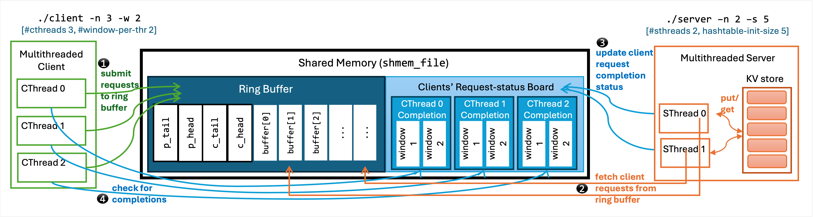

# Concurrent Key-Value Store

## Project Overview
This is an implementation of a concurrent key-value (KV) store using a client-server architecture. Both client and server are multi-threaded processes that communicate through a shared memory region. The system uses a ring buffer for inter-process communication and a thread-safe hash table to store key-value pairs.

## System Architecture


## Components

### Ring Buffer
- Thread-safe circular buffer for request submission and retrieval
- Supports concurrent access from multiple client and server threads
- Implements blocking behavior when full (client) or empty (server)

### Key-Value Store
- Hash table implementation with fine-grained locking for concurrent access
- Supports `put(key, value)` to insert or update values
- Supports `get(key)` to retrieve values

### Request-Status Board
- Shared memory region for tracking request status
- Allows clients to check completion status and retrieve responses

## Building and Running

To build the project:
```
make
```

To run the server:
```
./server -n <num_threads> -s <init_table_size>
```
Where:
- `-n` specifies the number of server threads
- `-s` specifies the initial hash table size

To run the client:
```
./client -n <num_threads> -w <window_size> [-f] [-i workload_file]
```
Where:
- `-n` specifies the number of client threads
- `-w` specifies the window size per client thread
- `-f` forks the server process automatically
- `-i` specifies the input workload file

## Design Decisions
- Used fine-grained locking in the hash table to allow multiple threads to access different buckets concurrently
- Implemented efficient synchronization in the ring buffer to minimize contention
- Organized shared memory to support multiple client threads with dedicated status windows

## Performance Considerations
- Multiple server threads can process requests concurrently to improve throughput
- Window size controls the maximum number of in-flight requests per client thread
- Thread-safe data structures are optimized to minimize lock contention
